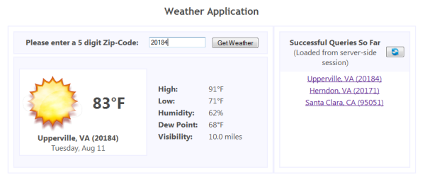

##[Introduction to GWT](http://developerlife.com/tutorials/?p=80)
* `Tutorial - Managing GWT History and Hyperlinks`: [developerlife.com ** tutorials/?p=232](http://developerlife.com/tutorials/?p=232)
* `Tutorial - Using Servlet Sessions in GWT`: [developerlife.com ** tutorials/?p=230](http://developerlife.com/tutorials/?p=230) | [Weather.zip](http://developerlife.com/tutorials/wp-content/uploads/2008/01/Weather.zip) | [Weather.war](http://developerlife.com/tutorials/wp-content/uploads/2008/01/Weather.war)

